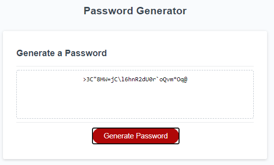
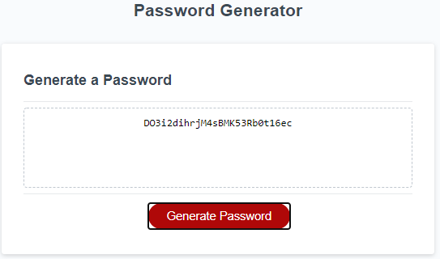
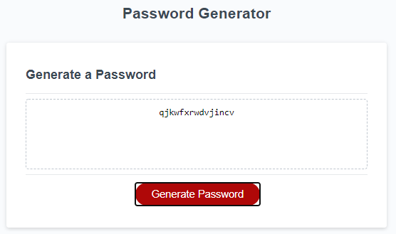
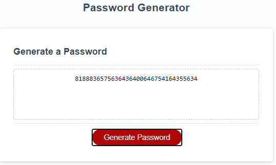
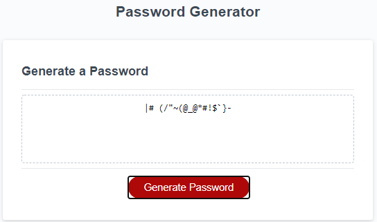
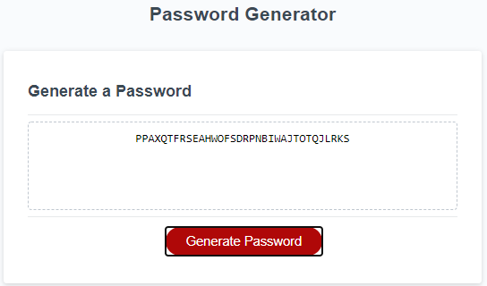

# Password-Generator
The application saved in this repo generates a random password based on the criteria selected by the user.

# Functions
A function named IndexReserve was created to reserve one index for each criteria
entered by the user. This is to avoid missing selected criteria for shorter
passwords. This function uses a random value to select the reserved index and store them in an array of objects. The random value range is limited by the length of password specified.

The RandomCodeGenerate function performs the heavy lifting in this application because its tasks is to generate characters based on the selected criteria: lowecase,
uppercase, number, and/or special symbols. The characters are generated by interpreting randomly generated UTF-16 values corresponding to different characters. Concept of linear equation was adopted to clamp the random values to a range.

All the function are integrated in the generatePassword to generate a string containing the password.

# Data Validation

Data Validation using while loops were included to prevent the user from entering a number less than 8 and greater than 128 for the number of characters. The same format was also used to prevent the user from selecting 'no criteria'. At least one criteria must be selected before the application would work.

# The application could be accessed using the following link:
https://apolinar291076.github.io/Password-Generator/

# The repo for the application could be accessed using the following link:
 https://github.com/Apolinar291076/Password-Generator.git
 
 
 # Screenshots
 
 with all criteria selected:
 
 
 
 with alphanumeric selected:
 
 
 
 with lower case only selected:
 
 
  
 with number only selected:
 
 
 
 with special character only selected:
 
 

 with uppercase only selected:
 
  
  
 
 
 
